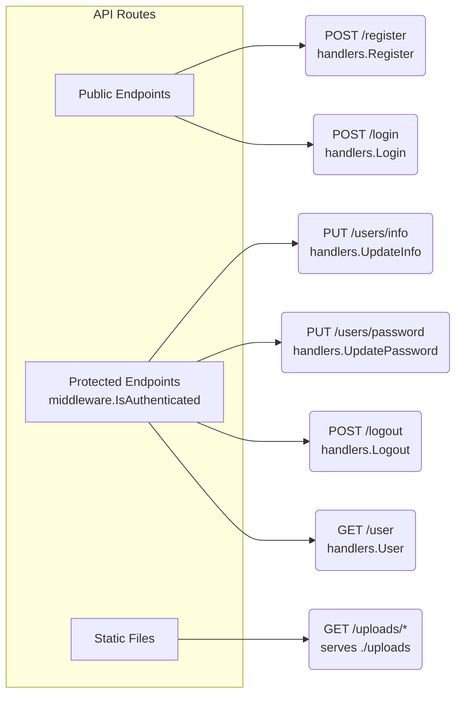

```mermaid
flowchart LR
    A[Public Endpoints] --> B(POST /register<br>handlers.Register)
    A --> C(POST /login<br>handlers.Login)
    D[Protected Endpoints<br>middleware.IsAuthenticated] --> E(PUT /users/info<br>handlers.UpdateInfo)
    D --> F(PUT /users/password<br>handlers.UpdatePassword)
    D --> G(POST /logout<br>handlers.Logout)
    D --> H(GET /user<br>handlers.User)
    I[Static Files] --> J(GET /uploads/*<br>serves ./uploads)

    subgraph API Routes
        A
        D
        I
    end
```